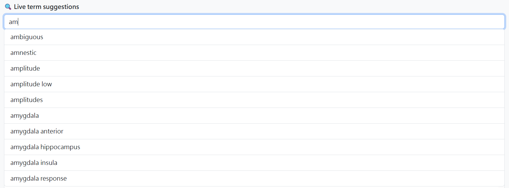
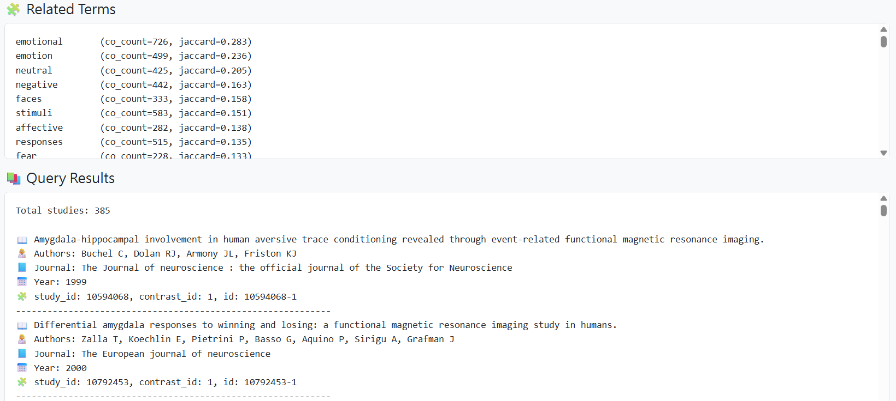
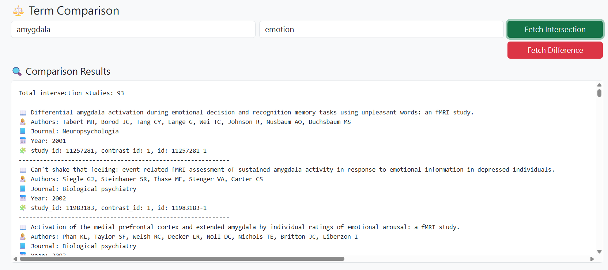

# 🧠 Neurosynth Frontend
This project implements an **interactive AJAX-based frontend** for exploring the **NeuroSynth** API service hosted at  
[`https://hpc.psy.ntu.edu.tw:5000`](https://hpc.psy.ntu.edu.tw:5000).

The web page allows users to:
1. 🔤 Dynamically search for neuroscience terms (live suggestions)
2. 🧩 Fetch related terms and corresponding study metadata
3. ⚖️ Compare two terms using logical relations (`AND`, `NOT`)

---

## 🚀 Features Overview

### 1️⃣ Live Term Suggestions (動態搜尋)
Users can start typing any term (e.g., `amygdala`, `emotion`), and the interface will display **auto-complete suggestions** based on the `/terms` endpoint.  
Suggestions update in real-time as the user types.

---

### 2️⃣ Related Terms & Studies Search (關聯詞與研究查詢)
After selecting a term, users can:
- **Fetch related terms** with co-occurrence and Jaccard index scores.
- **Fetch related studies** that mention the target term, showing detailed information such as title, authors, journal, and year.

---

### 3️⃣ Term Comparison: `AND` / `NOT` (詞彙交集與差集查詢)
Users can input two terms and query:
- **Intersection (`AND`)** → studies containing both terms.
- **Difference (`NOT`)** → studies containing the first term but not the second.

Each study entry lists:
- 🧩 study ID / contrast ID  
- 📖 title  
- 👩‍🔬 authors  
- 📘 journal  
- 📅 publication year  

---

## 🧰 Technical Details

- **Frontend:** HTML + JavaScript + Bootstrap 5  
- **API Endpoint:** [https://hpc.psy.ntu.edu.tw:5000](https://hpc.psy.ntu.edu.tw:5000)
- **AJAX Requests:** Fetch API (asynchronous JSON retrieval)
- **Dynamic Autocomplete:** implemented via `/terms` endpoint
- **Study Queries:**  
  - `/query/<term>/studies`  
  - `/query/<termA> and <termB>/studies`  
  - `/query/<termA> not <termB>/studies`

---

## 📸 Example Query Walkthrough

| Query Type | Example Input | API Request | Description |
|-------------|----------------|--------------|--------------|
| Related Terms | `amygdala` | `/terms/amygdala` | Returns top co-occurring terms |
| Studies | `amygdala` | `/query/amygdala/studies` | Returns all studies containing “amygdala” |
| Intersection | `amygdala`, `emotion` | `/query/amygdala and emotion/studies` | Returns 93 studies containing both |
| Difference | `amygdala`, `emotion` | `/query/amygdala not emotion/studies` | Returns 292 studies containing only “amygdala” |

---

## 💡 Notes
- The site requires access to NTU’s NeuroSynth API (`hpc.psy.ntu.edu.tw:5000`).
- Each section (live search / related terms / term comparison) uses asynchronous fetches for smooth interaction.
- This implementation demonstrates real-world **frontend–API integration** for neuroscience text mining.

---

## 🧑‍💻 Author
**譚靖蓉 (Anna Tan)**  
National Taiwan University · Master Program of Statistics  
Email: *r13h41009@ntu.edu.tw*  
GitHub Classroom Assignment: [NeuroSynth Frontend - HW07](https://classroom.github.com/a/yOwut1-r)
